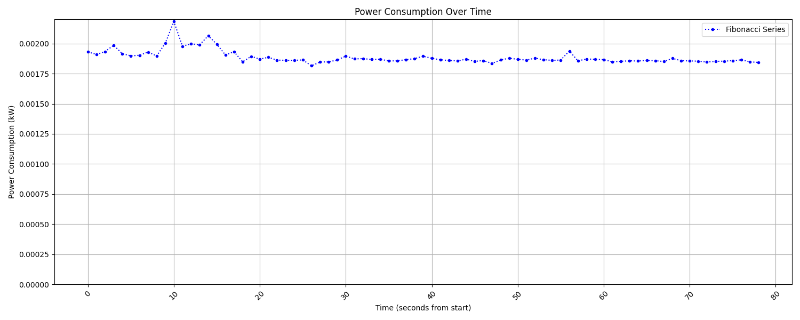

# Energy Monitor

## Overview

The Energy Monitor project provides a platform-specific solution to monitor and measure the power consumption of individual processes on Linux and macOS systems. This project includes a common interface, `EnergyMonitor`, which abstracts the methods for reading energy usage, CPU time, and measuring power consumption over specified intervals. Two concrete implementations, `LinuxEnergyMonitor` and `MacOSEnergyMonitor`, provide the necessary platform-specific logic.

## Features

- **Cross-Platform Monitoring:** Supports both Linux and macOS.
- **Power Consumption Measurement:** Calculates the power usage for a specified process (by PID) over a given duration and interval.
- **Data Logging:** Logs accumulated and interval power consumption data to CSV files for analysis.

## Installation

### Prerequisites

- **Python 3.6 or higher**
- **psutil** library (for macOS and process monitoring on Linux)

### Dependencies

Install the required Python packages using `pip`:

```bash
pip install -r requirements.txt
```

### Running the Monitor

1. **Clone the Repository:**

   ```bash
   git clone https://github.com/yourusername/energy-monitor.git
   cd energy-monitor
   ```

2. **Run the Monitor:**

   Depending on your operating system, run the corresponding script. Ensure you have the necessary permissions (sudo for macOS).

   - **Linux:**
     ```bash
     python linux_energy_monitor.py
     ```

   - **macOS:**
     ```bash
     sudo python macos_energy_monitor.py
     ```

## Usage

### Input Parameters

When running the script, you will be prompted for the following inputs:

- **PID (Process ID):** The process ID of the application you want to monitor.
- **Interval:** The time interval in seconds between each measurement.
- **Duration:** The total duration in seconds for the measurement.

### Output

- **Console Output:** Displays power consumption in watts (W) for each interval and total energy consumption in kilowatt-hours (kWh) over the specified duration.
- **CSV Files:** Two CSV files are generated:
  - `accum_data.csv`: Contains the timestamp and accumulated power consumption in joules.
  - `consumption_data.csv`: Contains the timestamp and power consumption in kilowatt-hours for each interval.

### Example

Running the monitor on a Linux system:

```bash
python linux_energy_monitor.py
```

Example input prompts:

```
Enter the PID to monitor: 12345
Enter the measurement interval in seconds (default is 1.0): 0.5
Enter the total duration of measurement in seconds (default is 10): 15
```

## Implementation Details

### EnergyMonitor Interface

Defines the common methods that need to be implemented for different platforms:

- **`read_energy()`**: Reads the current energy consumption.
- **`get_total_cpu_time()`**: Gets the total CPU time for the system.
- **`get_process_cpu_time(pid)`**: Gets the CPU time used by the specified process.
- **`measure_power_for_pid(pid, interval, duration)`**: Measures the power consumption for the specified PID over the given interval and duration.
- **`write_power_data_to_file(accum_data, consumption_data, accum_filename, consumption_filename)`**: Writes the accumulated and interval power consumption data to files.

### Platform-Specific Implementations

#### LinuxEnergyMonitor

- Uses the RAPL (Running Average Power Limit) interface to read energy consumption.
- Reads total and process-specific CPU times from `/proc/stat` and `/proc/[pid]/stat`.

#### MacOSEnergyMonitor

- Utilizes `powermetrics` to gather CPU power consumption data.
- Reads total CPU times using the `psutil` library.
- Retrieves process-specific CPU times using the `psutil` library.

## Plotting results

In order to graphically represent and gain an insight on the data, a custom plotting solution has been implemented in `plot.py` which expects a `.csv` file produced by the framework.



## Transforming to CO2

The file `kwh2co2.py` provides a function that converst kWh to CO2e grams. The function expects a carbon intensity coefficent, which is defaulted to the [average value in Germany](https://www.nowtricity.com/country/germany/).   

## Troubleshooting

### Linux

- Ensure your system supports Intel RAPL.
- Verify you have the necessary permissions to read from the RAPL files.
    - You can skip this step by using `sudo`.

### macOS

- `powermetrics` requires administrative access. Ensure you run the script with `sudo`.